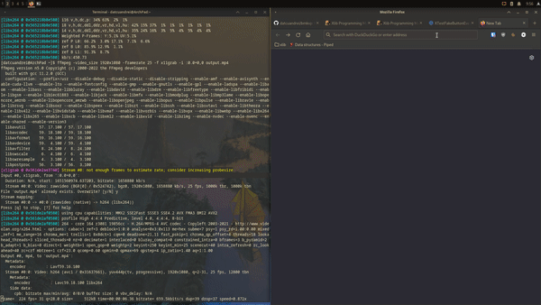

# bmkvp
Modal keyboard-driven virtual pointer.

 
 
 ## NOTE :
 This is by no means the finished product. bmkvp is still in active development, and the current published version is still in it's alpha stage.
 
 ## Build
 To build bmkvp, you need:
 - `gcc`
 - `libx11`
 - `libxtst`
 
 You may want to compile it using the following command:
 ```
 gcc -o bmkvp -I. bmkvp.c -lX11 -lXtst
 ```
 Also, in order for `bmkvp` to run properly, you need a desktop compositor(e.g. `compton`). Without one, bmkvp's background will be a solid black color, as there is no way to display RGBA color.
 
 ## Controls
 The default controls are based on your keyboard's numpad:
 
 
 
 - the arrows will move the grid
 - `7` will shrink the grid in the top left corner
 - `9` will shrink the grid in the top right corner
 - `1` will shrink the grid in the bottom left corner
 - `3` will shrink the grid in the bottom right corner
 - `5` will simulate the pointer click
 - `q` will exit bmkvp

 ## Customization
 If you want to customize bmkvp, you can do so by accessing the source code.
 The user configurable space is located @  and you can change the controls, precision of the pointer grid, transparency and color. The code is easily editable, so you can go even further with customizing it.
 You need to recompile bmkvp in order for the modifications to apply.
 
 ## Thanks
 This project was inspired by: 
 - 
 
 Also, this project was done with the help of the following resources:
 - 
 - 
 - 
 - 
 
 > I wanted to publish my resources, as Xlib is pretty poorly documented online and I know that it will help the people interested in learning Xlib.
 
 ## License
 `bmkvp` is licensed under the MIT License. To learn more about it, see .
